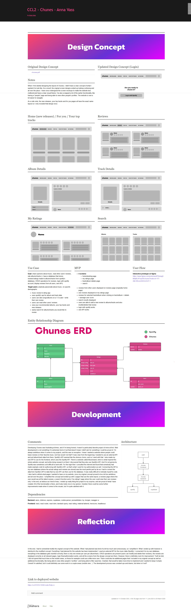

# Chunes

## About the project
Chunes is a multi-user, multi-platform web application for rating & reviewing music. Users are able to log in with their Spotify accounts, and give their own rating to any song or album on a 1 to 5 scale, as well as write their own review. Users can also delete and update their ratings & reviews, and of course, see other users' ratings as well.

## Documentation
